# 📱 Exercise Tracker Android App

> ⚠️ **Warning:** The Firebase database used in this project has expired.  
> Therefore, the app cannot be run successfully unless a new Firebase backend is configured.

---

## 1. Android

### 📌 Description

The Android Kotlin project is a mobile application designed to manage workout routines and explore music. With its intuitive interface, users can plan workouts, view nearby training locations, and listen to music while exercising — a practical solution for improving fitness and well-being.

---

### 🧱 Application Architecture

The app includes:

- **Firebase Database**: Stores user authentication data and workouts.
- **API Ninja** ([https://api.api-ninjas.com](https://api.api-ninjas.com)): Provides exercise info based on user input.

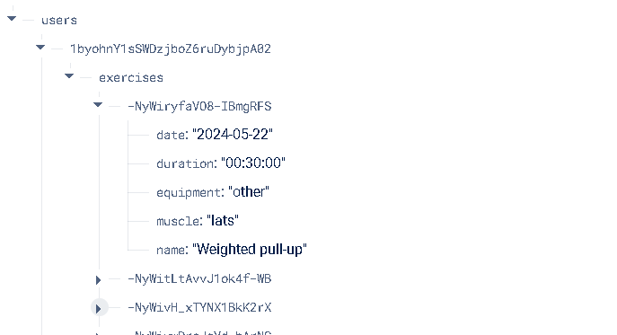

---

### 📂 Key Activities

- `LoginActivity.kt` – Handles login/registration.
- `MainActivity.kt` – Hosts all fragments and app navigation.
- `MusicListActivity.kt` – Displays and manages music playlists.

---

### 🧩 Core Fragments

- `AddExercisesFragment.kt` – Exercise search, selection, and duration tracking.
- `MapFragment.kt` – Interactive Google Map with gym markers.
- `MusicCategoryFragment.kt` – Shows music categories.
- `HomeFragment.kt` – Lists today's exercises with details and progress.

---

## 📲 Application Screens

### 🔐 1. Login Page

User login and registration via Firebase.

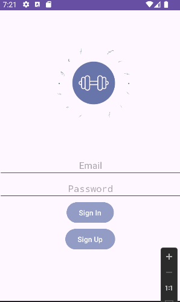

---

### 🏠 2. Home Page (`HomeFragment`)

Displays scheduled exercises for the day using `fetchTodayExercises()`.

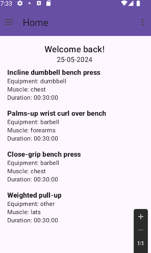

---

### 📚 3. App Drawer Menu

Navigation menu for Home, Add Exercises, Music, and Map.

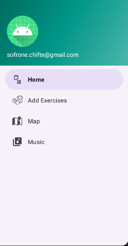

---

### ➕ 4. Add Exercises

Search and add exercises using external API.

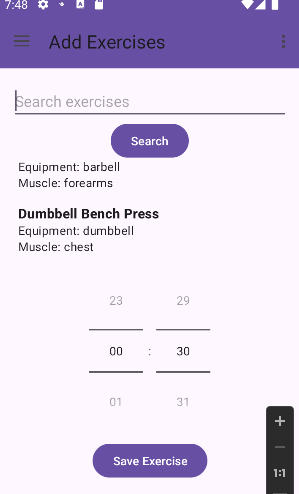

---

### 🗺️ 5. Map View

Interactive map for locating gyms.

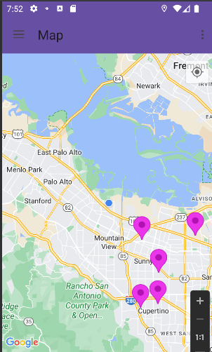  
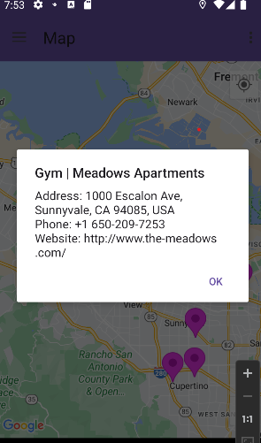

---

### 🎵 6. Music Categories

Browse available music categories.

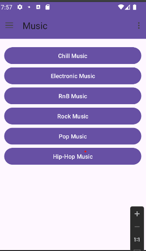

---

### 🎧 7. Music Playlist

Category-specific music list with player controls.

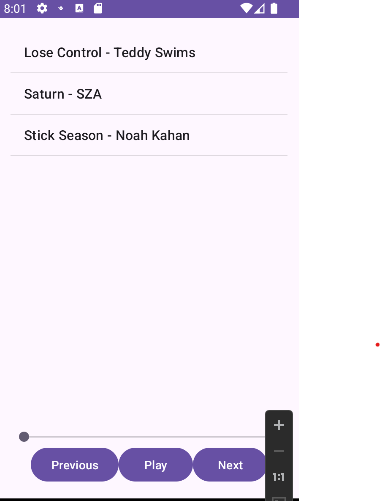

---

### 📊 8. Daily Progress Widget

Displays today's exercise progress on the home screen.

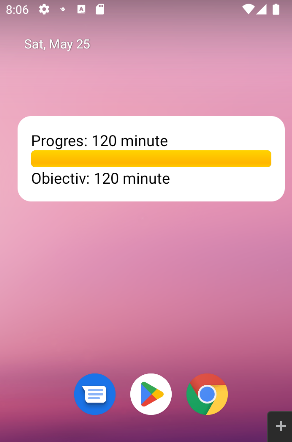

---

### 🔔 9. Notification

Shows a persistent notification while the app runs in the background.

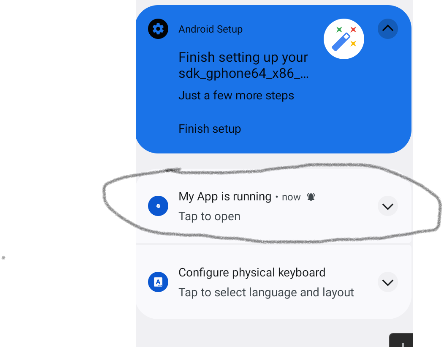

---

## 🧠 Core Logic Overview

### `MainActivity.kt`

- Sets up UI and navigation
- Handles drawer email
- Manages permission requests
- Launches `NotificationService`

---

### `ExerciseService.kt`

- Sends user queries to the external API
- Parses and returns exercises

---

### `FirebaseService.kt`

- Authenticates users
- Adds and fetches exercises
- Pulls today’s exercise list for Home and Widget

---

### `MusicPlayer.kt`

- Centralized `MediaPlayer` wrapper
- Play, pause, seek, next/previous
- Time tracking and UI sync

---

## ⚙️ Technologies Used

- **Kotlin** – Main language  
- **Firebase** – User authentication and data storage  
- **API Ninjas** – Exercise data  
- **Google Maps SDK** – Map integration  
- **MediaPlayer** – Music playback  
- **Android Studio** – Development environment  

---

> ⚠️ Reminder: Firebase has expired. You must configure a new backend to run the app.
